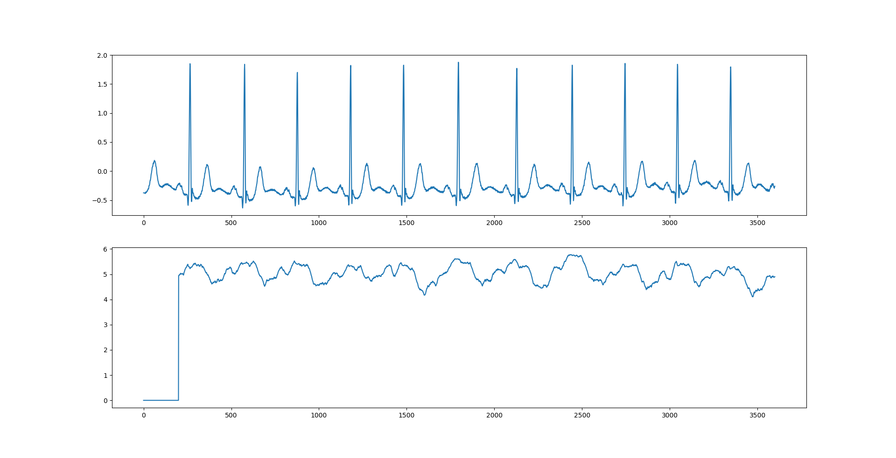
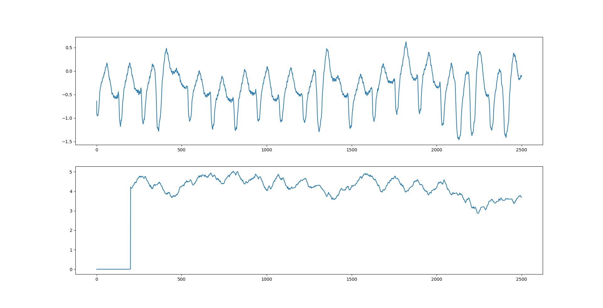
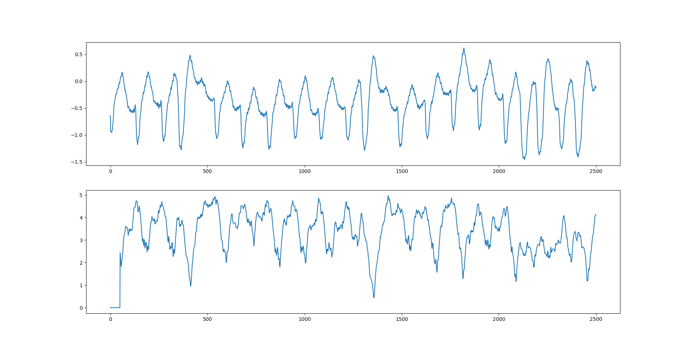
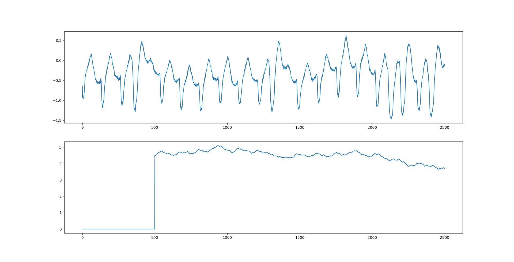

# 排列熵 Permutation Entropy
排列熵(Permutation Entropy, PE)算法是 *Bandt, Pompe(2001)* 提出的一种度量时间序列复杂性的方法，它首先通过相空间重构以及子序列排序提取序列模式的概率分布，再根据概率分布计算出这段时间序列的熵值。

## 相空间重构
假设有一段长度为的非线性系统的离散时间序列，我们希望从这段时间序列中提取信息，比如信号的复杂程度，这时候就需要对时间序列进行相空间重构。  
*Packard et al. (1980)* 对于时间序列的相空间重构，提出了两种重构方法，分别是导数重构法和坐标延迟重构法，这里采用的是坐标延迟法。使用坐标延迟法对相空间重构涉及到两个参数，一个是嵌入维度(Embedding Dimension) ，它控制生成的列向量的维度；另一个是延迟时间(Delay Time) ，它控制子序列的采样间隔，比如当 =1 时，即是连续取点；当 =2 时，即是间隔1个数取值。选定好参数  和  以后，可以得到一个矩阵：  
  
其中\tau;j=1,2,\cdots,k)。

## 排列熵计算
一维序列进行相空间重构后可以得到一个的矩阵，对矩阵行分块，分为个行向量，第行的向量%5Ctau%7D%5C%7D)称为。  
在内部进行排序，使得：  
  
由此可得到一个序列，表示已好排序的新数组内的元素原本在内的索引且。【注：这个操作类似于`numpy.argsort(arr)`，将数组内的元素进行排序然后返回各个数据的索引，但是在Python里面索引范围是0\~len(arr)-1】  
1~，共个数，可有种排列(permutation)，将这些排列按照字典序排序，然后编号为。统计序号向量组中的频数，再计算出每一个排列出现的概率。  
最后再根据香农熵(Shannon Entropy)的定义计算出排列熵：  
  
为了方便，可以将进行归一化处理，即：  
  
的大小表示时间序列的随机程度。的值越小，说明时间序列越规律；反之，则时间序列越接近随机。的变化反映并放大了时间序列的微小细节变化。
## 使用排列熵进行信号分析
由于心电信号的时间序列一般十分庞大，比如10秒的时间得到了2500个甚至3600个采样数据，在MIT-BIH的数据库里，有的记录时长甚至达到了24小时。因此，分析这些序列需要截短分段分析，将长度为  的心电信号长时间序列分为若干长度为  的子序列。这些子序列的截取相互之间可以重叠也可以不重叠。若截取片段的步长为1（也就是向后移动一位得到下一个子序列），这样可以得到的子序列个数为  ，然后再分别求每一段子序列的排列熵，最后将排列熵的图像画出。
### 不同类型信号的对比
下面是正常的窦性心律：

下面是心室颤动：

可以看到，心室颤动的排列熵曲线震荡幅度较大，排列熵值总体还有向下走的趋势。心室颤动的平均熵值比正常窦性心律要小，说明正常的心电信号的复杂程度比较高。  
下面这张图是突发的信号突变，在下面的图中可以看到突变的位置熵值有一定程度地变大。

### 不同的对比
此处对的取值进行研究，令，绘制出对应的排列熵曲线，进行比较。  
下面是ω=50：

下面是ω=200：

下面是ω=500：

从图中可以看到，随着的增大，排列熵曲线的震荡幅度逐渐收窄。
